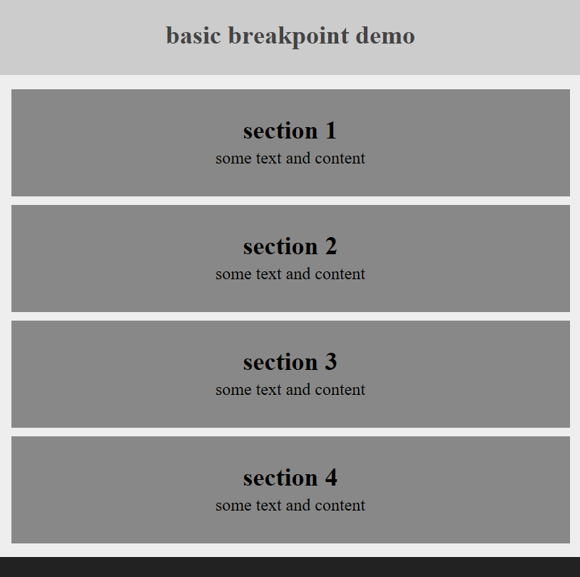
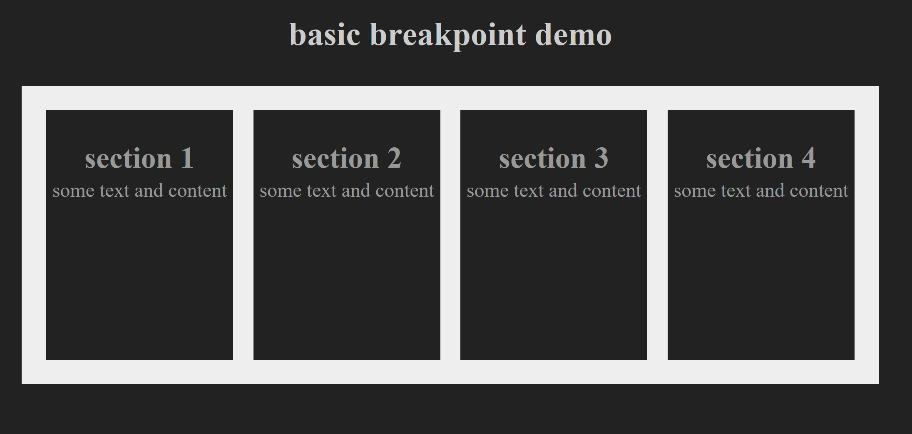

# Basic breakpoint exercise

This exercise is about responsive design. The idea is to create two breakpoints to allow for three distinct sizes as shown below.

Read the more detailed instructions on Blackboard.

<!--  -->